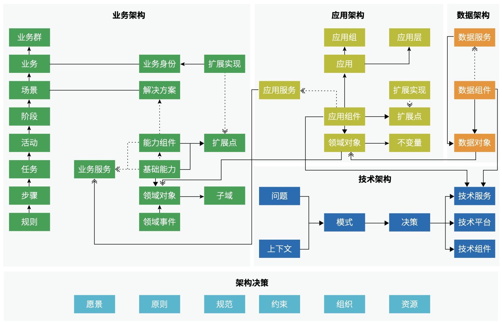

# 2.5 `现代企业架构框架` `元模型`总览

在展开介绍`架构`之前，我们需要先了解在`企业架构`领域非常重要的三个概念：`元模型`（Metamodel），`视角`（viewpoint）和`视图`（View）：

### `元模型`（Metamodel）

`元模型`是对于`架构`核心概念要素的精确定义和描述，`元模型`构成了`架构`设计的“基本语言要素”，通过`元模型`及其关系的表达，就可以通过结构化的方式对于`架构`进行描述和展现，`框架` `元模型`体现了`框架`设计者对于`企业级架构`本身的理解和抽象，是`企业级架构框架`的核心，是对于`架构`描述的`统一语言`。

在复杂的`平台型技术架构`中，是否能够对`架构`元素做准确的识别和直观的描述，直接影响`架构`设计方案是否被易于理解、使用和管理。

在现实世界中，结构化是我们理解、记忆和描述复杂事物的最佳方式，我们希望将其应用在`架构`设计中来增强`架构`的表现力，因此我们在设计时对`元模型`的主要考量因素有：

1. `架构`元素的职责明确且易于理解
2. `架构`元素的职责之间相互正交
3. `架构`元素之间存在清晰可辨的层次关系

我们使用带有明确职责属性的分类方式定义`架构`元素，同时我们对元素的职责进行了符合`平台化`特征的重新定义，最终组成轻量的结构化的描述`元模型`。

### `视角`（Viewpoint）

`企业架构`设计因为是在对于企业本身的进行`架构`设计，因其抽象程度较高，同时涉及各类不同的`干系人`和`组织`，不同的`干系人`和`组织`基于自身所处`岗位` `角色`和职责的不同，对于`架构`的关注点和`视角`也存在比较大的差异。因此，通过不同的`视角`（Viewpoint）的抽象，就可以充分体现我们在审视和进行`企业架构`设计时，处于什么样的观察位置和角度，兼顾不同`干系人`的`架构`设计诉求。不同的`视角`（Viewpoint）会关注`架构`的不同切面，以及在这个切面下的`元模型`要素以及他们之间的关系，这就构成了不同的`架构视图`（View）。

### `视图`（View）

一个`视图`描述了从一个或一组相关的`视角`（Viewpoint）出发，通过组合这类`视角`所关注的`元模型`（Metamodel）要素及其关系，通过设计与`建模`之后，形成的切面`视图`。一个`视图`（View）体现了在一类`视角`（Viewpoint）下对其关注的`架构元模型`要素及其关系的描述和可视化。

在`现代企业架构框架`（MEAF）的设计上，我们最大化的延续和集成了`经典企业架构框架`对于`视角`（Viewpoint）和`视图`（View）的划分，当前版本主要从`业务架构`、`应用架构`、`数据架构`和`技术架构`四类`架构视图`出发，将关注点聚焦于在不同`架构视图`下，针对`平台型企业架构`设计这个大的前提和背景，如何设计和应用`元模型`（Metamodel）重新对于`企业架构` 建模，满足企业对于`现代企业架构`设计的需求的同时，保证`企业架构`设计的可落地。

下面就将根据不同的 `视图`（View）以`元模型`（Metamodel）为主线，展开详细介绍`现代企业架构框架`（MEAF）的`架构`设计要素和应用场景。

（图 2.5-2 MEAF Metamodel）