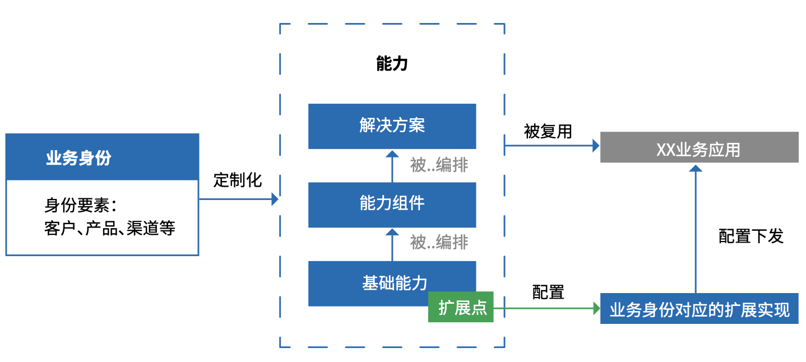
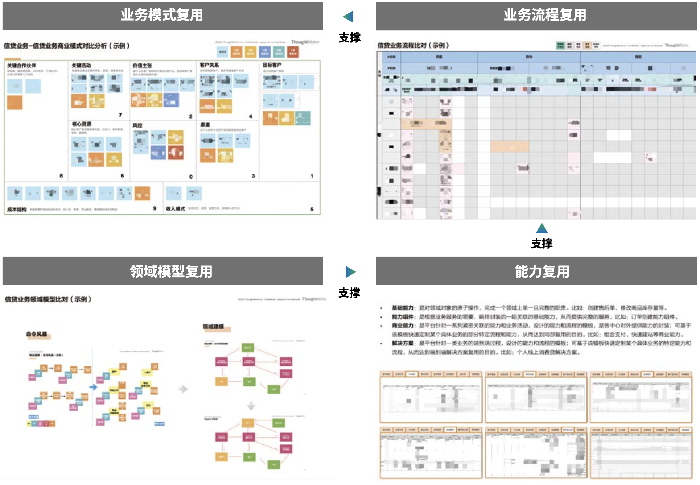

# 3.2 `业务架构元模型` 应用

## 3.2.1 `现代业务架构`典型问题

在帮助企业构建`业务架构`的过程中，我们发现大部分企业正面临共同的问题：如何抽离多`业务线`共享的`能力`，集中管控和演进，以避免重复投资？新`业务`如何基于企业`能力`快速组装上线，以支撑`业务`快速迭代创新？

问题的背景和起因在于，当大型企业的业务发展到达一定规模，多条`业务线`并存、或多个`业务单元`并行发展，IT 建设会随着`业务`边界、`组织`边界，不可避免的进一步分化，也加剧了 IT 部门进行统一管控的困难。

一方面，在很多场景中，这样的分化带来了双重投资甚至多重投资的浪费，另一方面也在加剧本就存在的用户或者客户体验的割裂、数据孤岛、IT 翻新周期长等固有问题。

同时，当`业务线`不断尝试新的业务模式，或对于已有模式进行更快的试验、调整与扩展。对于 IT 支撑的响应力也提出了更高的要求。固有的系统搭建或者产品部署模式，越来越不足以提供及时的响应，且在“快速试错”、“小步快跑”的创新场景应对下，成本高昂。

为了解决上述问题，我们对问题进行了进一步拆解：

  * Q1：什么是可共享复用的`能力`？
  * Q2：如何识别和构建`能力`？
  * Q3：如何使用`能力`，实现新`业务`快速上线？

在对问题进行上述拆解后，我们将基于`业务架构元模型`逐一解决。

## 3.2.2 什么是可共享复用的`能力`？

在`现代企业架构`中，面向`能力`的规划超越面向`功能`与`服务`的规划成为企业级`业务架构`规划的关注要点，如何基于`能力`的识别与规划，最大化的沉淀企业级可复用的`能力`，并通过扩展、编排和组合等形式应用到更多的场景，是平台型企业架构`需要解决的关键问题。

企业为了应对`业务`的快速迭代、多场景和不确定性，需要在平台上构建可复用的“`能力`”以及为`能力`提供必要的扩展与可变机制，以此为不同前台提供灵活多变的`业务服务`，满足不同前台差异化个性化的的需求。

而“`能力`”根据粒度的不同，可再度细分为“`基础能力`”、“`能力组件`”和“`解决方案`”三个层级。不同`业务`的差异性，则可通过`能力`的“扩展点”设计和不同“`业务身份`”在`扩展点`上的“扩展实现”进行区分。

总体实现机制如下：

( 图 3.2-2 企业`能力`共享复用的实现机制 )

  * `业务身份`：
  “`业务身份`”的概念最早由阿里巴巴提出，业务平台在对各`业务`同时提供`服务`时，需要能区分每一次`业务服务`请求的`业务身份`要素，以便提供差异化个性化的`服务`；因此需要对企业各业务的身份和特征进行`建模`和区分，其产出即为“`业务身份`”。
  `业务身份`是`业务`在平台中的代名词，是在业务运营中唯一区分某个具体`业务`的 ID。平台基于`业务身份`匹配该特定业务的`流程`和业务规则，并基于`业务身份`实现`服务`路由、需求溯源、业务监控和业务隔离。
  * `基础能力`：
  是对`领域对象`的原子操作，完成一个`领域对象`上单一且完整的职责。比如：创建售后单、修改商品库存量等，是`能力`组合和复用的最小单元。
  * `能力组件`：
  `能力组件`是对`基础能力`的进一步封装，目的是方便`业务`的使用。按封装粒度不同分为两类：第一类`能力组件`是根据`业务服务`的需要编排封装的一组关联的`基础能力`，从而提供完整的`服务`。比如：订单创建能力组件。第二类`能力组件`是平台针对一系列紧密关联的业务活动，设计的`能力`模板，可基于该模板快速定制某个具体`业务`的特定流程和能力，从而达到复用全部关联`能力`的目的。比如：“组合支付”、“快速建站”等`能力组件`。`能力组件`加快了`业务`接入平台的速度，让业务侧专注业务本身，不再需要耗费精力在理解平台大量的`基础能力`上。
  * `扩展点`与`扩展实现`：
  “`扩展点`”是对`基础能力`的可变性设计，在技术侧体现为`基础能力`实现中的某一个步骤的接口定义，而接口的一个实现即为一个“`扩展实现`”。比如：订单渲染`基础能力`中有一个步骤是订单总价试算，而正常时期的总价试算规则与秒杀时期的总价试算规则是不同的，因此需要对订单渲染`基础能力`设计“订单总价试算规则”的`扩展点`，并分别定义在正常时期和秒杀时期的`扩展实现`。
  * `解决方案`：
  是平台针对一类共性业务的端到端过程设计的`能力`模板；可基于该模板快速定制某个具体`业务`的特定`能力`和流程，从而达到业务`模式`级别复用的目的。比如：虚拟物品交易`解决方案`。

## 3.2.3 如何识别和构建`能力`？

识别构建`能力`的过程分为“`业务梳理`”和“`模式设计`”两个阶段。

在`业务梳理`阶段：对企业`业务`、`流程`、`组织`、`业务服务`和业务规则进行细致完整地梳理，作为后续`模式设计`的基础和输入。

而在`模式设计`阶段：则会通过`流程建模`、`领域建模`、`业务身份建模`和`能力建模` 4 个步骤完成企业`能力`的识别构建。

具体过程如下：

( 图 3.2-3 识别和构建`能力`的过程 )

`模式设计`阶段中：

  * `流程建模`：负责识别共性`业务`，并抽取通用`流程`，设计`可变点`，作为可复用性分析的基础。
  * `领域建模`：负责基于`流程建模`结果，识别`领域事件`和`领域对象`，并划分`子域`的`边界`；`领域对象`构成了提供可复用能力的基本单元，对`领域对象`的操作即是`基础能力`。
  * `业务身份建模`：负责定义`业务身份`识别的要素和`业务身份`解析规则，用于给可复用的`能力`区分不同的`业务身份`要素。
  * `能力建模`：负责最终完成平台三类可复用`能力`的设计，即“`基础能力`”设计、“`能力组件`”设计和“`解决方案`”设计。

下面将详细说明各步骤的实施方法：

## 3.2.3.1 `流程建模`

为了提取可复用的`能力`，首先需要识别共性`业务`，然后将同一类共性的`业务`抽象提炼出通用`流程`，并基于通用`流程`进行`可变性`分析。

具体方法是按`业务架构`中`流程`部分的`元模型`（`阶段`、`活动`、`任务`、`步骤`、`业务规则`），结合自上而下以及自下而上的方式逐层提炼收敛通用`模型`和`可变点`。

总体实现机制如下：

( 图 3.2-4 `流程建模的`总体实现机制 )

提炼通用`流程`后的`可变性`分析，旨在找出“什么在变”、“为什么变”和“怎么变”，因此`可变性`模型主要由：“`可变点`”、“`可变点`实现”以及“`可变点`、`可变点`实现之间的关系”三部分组成。

 ( 图 3.2-5 `可变性`模型的组成部分 )

 综上所述，`流程建模`的主要步骤如下：
  * 分析`业务`组合，提取共性`业务`。
  * 分析所有共性`业务`的各`流程` `步骤`及其输出对象，抽象提炼通用`步骤`和业务实体；识别各`业务`的差异部分，提炼设计`可变点`，确定`可变点`实现和关系。
  * 分析所有共性`业务`的各`流程` `任务`，抽象提炼通用`任务`；识别各`业务`在`任务`上的差异部分。
  * 分析所有共性`业务`的各`流程` `活动`，抽象提炼通用`活动`；识别各`业务`在`活动`上的差异部分。
  * 分析所有共性`业务`的各`流程` `阶段`，抽象提炼通用`阶段`；识别各`业务`在`阶段`上的差异部分。

## 3.2.3.2 `领域建模`

`领域`是指`组织`的`业务`范围以及在其中所进行的活动，也就是平台`能力`需要支撑的`业务`范围。因此，为了构建出平台能力，需要对`业务` `领域`进行深入的理解和设计。

在`业务架构`部分，将进行`领域`战略层级的`建模`，主要包括：“`子域`”、“`领域对象`”、“`领域事件`”部分的设计。

( 图 3.2-6 `领域`战略层级`建模`的组成部分 )

`领域`战略层级`建模`的过程如下：

( 图 3.2-7 `领域`战略层级`建模`的过程 )

### 3.2.3.2.1 `领域事件`识别

`领域事件`（Domain Event）：是领域专家关心的，在`业务`上真实发生的事件，这些事件对系统会产生重要的影响，如果没有这些事件的发生，整个业务逻辑和系统实现就不能成立。我们可以通过`领域事件`对过去发生的事情进行溯源，因为过去所发生的对业务有意义的信息都会通过某种形式保存下来。比如：“用户地址已更新”、“订单已发货” 等`领域事件`。

`领域事`件对系统常见的影响有：

  * 对内
    - 产生了某种数据
    - 触发了某种`流程`或事情
    - 状态发生了某种变化
  * 对外
    - 发送了某些消息

目前比较常用的`领域事件`识别方法是“事件风暴（Event Storming）”，主要步骤如下：

  * 邀请业务专家（或领域专家）和技术专家共同参与事件风暴工作坊，其它参与角色按需补充。
  * 明确和选择需要分析的业务场景。
  * 确定起始事件和结束事件，事件以“XXX 已YYY”的形式进行命名（对于英文版过去完成时的中文表达方法）。
  * 根据场景和业务复述的复杂度，决定以时间线的哪个方向开始梳理事件（正向或逆向）。
  * 以先发散再收敛的方式，按照时间线的先后顺序和并行关系，补充和完善领域事件。
  * 使用“规则”抽象分支条件或复杂的规则细节，通过抽象降低分支复杂度，规则以“XXX 规则”的名词形式进行命名。
  * 完成一遍事件梳理之后，通过问问题的方式，逆向检查（Reverse Check）事件流的逻辑合理性，例如：
    - 该事件真的需要在系统实现的时候考虑吗？
    - 该事件如果存在，那它的前提条件是什么？
    - 该事件如果要产生，那它的前一个事件必须是？
  * 重复以上步骤，迭代式的完成全部领域事件的识别。

`领域事件`识别的示例如下：

( 图 3.2-8 `领域事件`识别的示例 )

### 3.2.3.2.2 领域对象识别

`领域对象`（Domain Object）：是对`业务`的高度抽象，作为`业务`和系统实现的核心联系，`领域对象`封装和承载了业务逻辑，是系统设计的基础。

`领域建模`中重要的部分之一就是对“`领域对象`”及`领域对象`之间关系的识别和设计。而`领域对象`识别将基于前面`领域事件`识别的结果开展。

`领域对象`，通常包含（但不限于）：
  * `领域事件`中出现了的名词；
  * 如果没有信息系统，在现实中会看得见摸得着的事物（例如订单）；
  * 虽然在当前业务中看不见摸不着，但是可以在未来抽象出来的业务`概念`。

在领域驱动设计（Domain-Driven Design）（参考文献 7）中一般存在三类`领域对象`：

1. 聚合根：是`领域对象`的根节点，具有全局标识，对象其它的实体只能通过聚合根来导航；如订单可以分为订单头和订单行，订单头是聚合根，它包含了订单基本信息；订单行是实体，它包含订单的明细信息，聚合跟所代表的聚合实现了对于业务一致性的保障，是业务一致性的边界。
2. 实体：是`领域对象`的主干，具有唯一标识和生命周期，可以通过标识判断相等性，并且是可变的，如常见的用户实体、订单实体；
3. 值对象：实体的附加业务概念，用来描述实体所包含的业务信息，无唯一标识，可枚举且不可变，如收货地址、合同种类等等。

`业务架构`只负责初步和整体识别`领域对象`，而对`领域对象`的分类（聚合根、实体、值对象）和战术层级的详细设计将在`应用架构`设计部分完成。

`领域对象`识别的主要步骤如下：

  * 对每一个`领域事件`，快速识别或抽象出与该`领域事件`最相关（或隐含的）的业务`概念`，并将其以名词形式予以贴出。
  * 检查领域名词和`领域事件`在概念和粒度（例如数量，单数还是集合）上的一致性，通过重命名的方式统一语言，消除二义性。
  * 如果在讨论过程中，有任何因为问题澄清和知识增长带来的对于之前各种产出物的共识性调整，请不要犹豫，立刻予以调整和优化。
  * 重复以上步骤，迭代式的完成全部`领域对象`的识别。
  
`领域对象`识别的示例如下：

( 图 3.2-9 `领域对象`识别的示例 )

### 3.2.3.2.3 `子域`划分

`子域`（Subdomain）：是对问题域的澄清和划分，同时也是对于资源投入优先级的重要参考。比如：“订单子域”、“物流子域”等，`子域`的划分仍属于`业务架构`关注范畴。

`子域`的类型分为：

( 图 3.2-10 `子域`的类型 )

1. `核心域`（Core Domain）：是当前产品的核心差异化竞争力，是整个`业务`的盈利来源和基石，如果`核心域`不存在那么整个`业务`就不能运作。对于`核心域`，需要投入最优势的资源（包括能力高的人），和做严谨良好的设计。
2. `支撑域`（Supporting Subdomain）：解决的是支撑`核心域`运作的问题，其重要程度不如`核心域`，但具备强烈的个性化需求，难以在业内找到现成的`解决方案`，需要专门的团队定制开发。
3. `通用域`（Generic Subdomain）：该类问题在业内非常常见，所以很可能有现成的`解决方案`，通过购买或简单修改的方式就可以使用。

`子域`划分的示例如下

( 图 3.2-11 `子域`划分的示例 )

`子域`划分的主要步骤如下：

  * 根据“每一个问题`子域`负责解决一个有独立`业务`价值的业务问题”的视角出发，可以通过疑问句的方式来澄清和分析`子域`需要解决的业务问题，例如“如何进行库存管理？（英文描述类似 How to…？）”。
  * 利用虚线，将解决同一个业务问题的`限界上下文`以切割图像的方式划在一起，并以“XXX 子域”的形式对每个`子域`进行命名。
  * 根据三种类型的`子域`定义，共同结合`业务`实际（或者参考设计思维中的电梯演讲），确定每个`子域`的`子域`类型。

## 3.2.3.3 `业务身份`建模

`业务身份`由“`业务身份 ID`”、“`业务身份名称`”、“`业务身份要素定义`”、“`业务身份识别解析规则`”四个部分组成。

( 图 3.2-12 `业务身份`的组成部分 )

其中，`业务身份要素`定义是最基础、也是最难的部分。企业应根据自身业务特征对`身份要素`进行识别定义，常见的`身份要素`维度包括但不限于：客户、产品和渠道等。

`业务身份要素`除了对要素维度进行抽取识别，还需要定义每个要素维度所包含的`领域对象`（包括`领域对象`的属性）；这些`领域对象`及其属性用来定义`业务身份识别解析规则`。实现机制如下：

( 图 3.2-13 `业务身份`解析机制 )

`业务身份`建模的主要步骤如下：
  * 分析`业务`组合，提取`业务身份要素`维度。
  * 确定各`业务身份要素`维度对应的`领域对象`（包括`领域对象`的属性）。
  * 确定`领域对象`各属性的取值条件规则，定义`业务身份识别解析规则`。
  * 指定`业务身份名称`。
  * 指定`业务身份 ID`。

## 3.2.3.4 `能力`建模

`能力`建模分为“`基础能力和扩展点设计`”、“`能力组件设计`”和“`解决方案设计`”三个部分，过程顺序如下：

( 图 3.2-14 `能力`建模的过程顺序 )

### 3.2.3.4.1 `基础能力与扩展点设计`

`基础能力`：是对`领域对象`的原子操作，完成一个领域上单一且完整的职责。比如：创建售后单、修改商品库存量等。

`扩展点与扩展实现`：“`扩展点`”是对`基础能力`的`可变性`设计，在技术侧体现为`基础能力`实现中的某一个步骤的接口定义，而接口的一个实现为一个“`扩展实现`”。比如：订单渲染基础能力中有一个步骤是订单总价试算，而正常时期的总价试算规则与秒杀时期的总价试算规则是不同的，因此需要对订单渲染`基础能力`设计“订单总价试算规则”的`扩展点`，并分别定义在正常时期和秒杀时期的`扩展实现`。

不同的`业务`通过使用同一个基`础能力`来达成共享复用的目的，而不同`业务`在业务规则上的差异性，则通过定义该`基础能力`在`扩展点`上的不同`扩展实现`来区分。

需要注意的是，通常这套机制需要技术上的开发`框架`支持。

`基础能力与扩展点设计`的主要步骤如下：
  * 对`流程建模`步骤中输出的各“`任务`”下的所有“`步骤`”，确定其对应的`领域对象`（注意，该`领域对象`应来自于前面的`领域建模`步骤）。
  * 根据`步骤`对`领域对象`的操作，设计对应的`基础能力`；`基础能力`的设计应遵循如下原则：
    * 完成对一个`领域对象`单一且完整的`操作`职责
    * `基础能力`操作的`领域对象`最大不能超出单个聚合，最小不能破坏业务的一致性要求
    * `基础能力`的输入与输出建议对象化，以规范使用
    * 根据`流程`建模步骤中识别出的与该`基础能力`有关的`可变点`，以及各`业务身份`在该`可变点`上不同的`业务规`则，提炼设计出`基础能力`的`扩展点`
  * 确定`扩展点`的默认实现（即默认情况下`基础能力`执行的业务规则）

### 3.2.3.4.2 `能力组件`设计

`能力组件`：是对`基础能力`的进一步封装，目的是方便业务的使用。`能力组件`加快了业务接入平台的速度，让业务侧专注`业务`本身，不再需要耗费精力在理解平台大量的`基础能力`上。

`能力组件`按封装粒度不同分为两类：

第一类`能力组件`是根据`业务服务`的需要编排封装的一组关联的`基础能力`，从而提供完整的`业务服务`。比如：订单创建能力组件。

第二类`能力组件`是平台针对一系列紧密关联的`业务` `活动`，设计的`能力模板`，可基于该模板快速定制某个具体`业务`的特定`流程`和`能力`，从而达到复用全部关联`能力`的目的。比如：“购物车”、“结算”、“快速建站”等`能力组件`。

实现机制及示例如下：

( 图 3.2-15 `能力组件`的实现机制及示例 )

`基础能力`与`能力组件`的设计都基于`流程建模`和`领域建模`的结果，各设计产出要素的对应关系如下：

（图3.2-16 `基础能力`、`能力组件`设计与`流程`和`领域建模`的关系）

`能力组件`设计的主要步骤如下：

  * 对`流程建模`中输出的每个`任务`，`设计`其所需的`业务服务`，可采用`服务蓝图`的方法进行`业务服务`设计。
  * 对每个`业务服务`，封装编排满足其需求的一组`基础能力`成为第一类`能力组件`。
  * 对`流程建模`中输出的`阶段`和业务`活动`进行逐项分析，从`价值交付`和阶段性`价值交付`的角度，识别对应的一系列紧密关联的业务`活动`；将这些业务`活动`包含涉及的所有`能力组件`和`基础能力`封装定义为第二类`能力组件`。

### 3.2.3.4.3 `解决方案`设计

`解决方案`：是平台针对一类共性`业务`的端到端过程设计的`能力`模板；可基于该模板快速定制某个具体`业务`的特定`能力`，从而达到业务模式复用的目的。比如：虚拟物品交易解决方案。

从以上定义可以看出，`解决方案`的核心是对共性`业务`进行识别提取和对`业务`全部`能力`进行模板化封装。

（图3.2-17 `解决方案`设计的过程）

`解决方案`设计的主要步骤如下：

  * 识别和提取`共性业务`。
  * 对`共性业务`进行`流程建模`和`领域建模`，具体方法参见前面所述。
  * 进行`基础能力`和`扩展点`设计。
  * 进行`能力组件`设计。
  * 基于`通用流程`，将`共性业务`中包含的所有`基础能力`、`扩展点`和`能力组件`封装定义为`解决方案`。

## 3.2.4 如何复用`能力`，实现新`业务`快速上线

## 3.2.4.1 多层级复用

在`平台化架构`中，`能力`的复用可分为三个层级：

|复用层级|复用对象| 特征| 业务价值|
|-|-|-|-|
|`能力`共享|`基础能力` `领域模型`|支持同一个业务场景的多个`能力消费者`，主要解决数据一致性问题。如常见的全渠道策略下，多个渠道客户端使用同一个服务端`能力`|低|
|`能力`复用|`业务流程` `能力组件` `基础能力` `领域模型`|提供单点的`能力`，支持不同业务场景的多个`能力消费者`。由于只提供`业务场景`中的某一小段，对业务流程的抽象要求适中，需要一定的扩展机制|中|
|`业务模式`复用|`解决方案` `业务流程` `能力组件` `基础能力` `领域模型`|提供多个连续或关联的`能力`，支持不同`业务场景`的多个`能力消费者`。对`业务流程`的抽象要求高，由于需要支持不同`业务模式`对同一个`业务流程`的差异化需求，必须有灵活的扩展机制|高|

其中`业务能力`复用和`业务模式`复用层级都对可复用`能力`的识别和设计提出了要求。因此，基于前面论述的可复用`能力`构建方法，我们就能实现这两层的复用效果。

多层级复用为什么能实现呢？

首先在于底层`领域模型`的设计，有了建模后的`领域对象`提供共享的`基础能力`，再加上`扩展机制`，就能实现`基础能力`在不同`业务`上的复用；

而经过`通用流程`的建模，这些`基础能力`又能进一步组装成更大粒度的可复用`能力组件`，从而实现局部`业务流程`的复用；

如果`业务流程`的复用能够延伸到`业务`的全`流程`，即对于同一类`共性业务`其全`流程`都能基于一个`解决方案`模板定制，而这个`解决方案`模板是其下所有`能力组件`和`基础能力`的封装，那么新的`业务`只需定制该`解决方案`模板即可实现`业务模式复用`，快速上线新`业务`。

其关系如下：

（图 3.2-18 多层级复用的关系）

## 3.2.4.2 复用`基础能力`和`能力组件`

在识别和构建了平台的`基础能力`和`能力组件`之后，不同`业务`就能针对特定的业务需求复用它们并快速定制。方法是对`基础能力`下的`扩展点`进行`扩展实现`的配置和开发，示例如下：

（图 3.2-19 复用`基础能力`和`能力组件`的示例）

复用`基础能力`和`能力组件`的主要步骤如下：

  * 配置新`业务`对应的`业务身份`在各`基础能力` `扩展点`上的`扩展实现`，如果无需定制可直接采用默认`扩展实现`。
  * 开发`基础能力`的`扩展实现`。
  * 根据`业务流程`，编排`基础能力`和`能力组件`，实现业务需求。
  * 对于现有`能力`不能满足业务需求的情况，需要`平台`侧新增开发任务，修改或者新增`基础能力`和`能力组件`；然后`应用`侧按上述过程完成定制使用。

## 3.2.4.3 复用`解决方案`

对于新`业务`，如果已构建了其所属`共性业务`的`解决方案`，则可通过复用该`解决方案`进行`业务`的快速定制。方法是：基于`解决方案`的通用流程定制新业务流程，并对`基础能力`下的`扩展点`进行`扩展实现`的配置和开发。

（图 3.2-20 复用`解决方案`快速定制新`业务`）

复用`解决方案`的主要步骤如下：

  * 基于选定的`解决方案`，配置新`业务`的`业务`全`流程`。
  * 配置新`业务`对应的`业务身份`在各`基础能力` `扩展点`上的`扩展实现`，如果无需定制可直接采用默认`扩展实现`。
  * 开发`基础能力`的`扩展实现`。
  * 根据`业务`全`流程`，编排`基础能力`和`能力组件`，实现业务需求。
  * 对于现有`能力`不能满足业务需求的情况，需要`平台`侧新增开发任务，修改或者新增`基础能力`、`能力组件`和`解决方案`；然后`应用`侧按上述过程完成定制使用。

