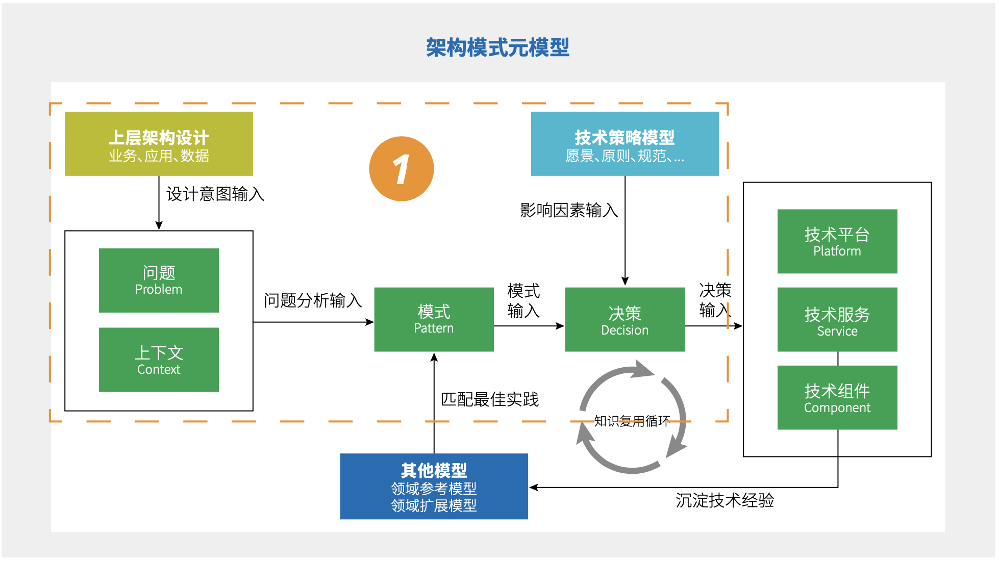

# 6.2 `技术架构元模型`应用

## 6.2.1 富技术时代如何做好`平台型技术架构`设计

受益于新技术的涌现和不断成熟，及技术工具的极大丰富，`技术架构`设计的灵活度和效率都得到了显著提升。

另一方面，在`平台型技术架构`的设计中，作为多`业务条线`、多`应用`、多数据场景落地的技术基座，`技术架构`设计所需覆盖的规模、应对的复杂度今非昔比。加之“富”技术条件的加持，一个好的`技术架构`设计的困难度实际上指数级增加。而一直以来，本质上是强依赖`架构师`的经验和能力的`技术架构`设计方法和过程，在这样的语境下，一系列挑战和问题再次凸显：

  * 对于`架构`需求把握不足或者没有`架构`需求的分析意识，过早的进入`架构`设计，导致系统复杂度变高甚至过度设计，为开发落地带来额外的研发成本
  * `架构`设计采用的技术和工具过于超前，超出团队成员技术水平，造成落地难度高，新成员上手速度慢，进而对整体进度和实施效果造成影响
  * `架构`设计过程时间长，完成后团队就不再愿意对设计方案继续调整和迭代，当技术发展变化很快时，设计完成时方案已经过时。
  
  因此，富技术时代下，做好`平台型技术架构`设计的关键是：
    * 系统性的分析`架构`需求
    * 结构化的设计`架构`方案
    * 沉淀可复用的`架构`经验

( 图 6.2-2 `技术架构元模型`的应用 )

## 6.2.2 系统性的分析架构需求

在`架构`咨询过程中，我们看到很多由不良`架构`引发的问题现象，分析背后的核心因素时，都指向了一个关键原因，即缺少前期对`架构`设计需求的系统性分析。当技术团队被问到为什么使用某种设计思路，为什么使用某种`技术组件`时，得到回答往往跟其自身的主观经验有很大关系。

这带来的重要影响是`架构`质量与设计者经验密切相关，而经验的传递成本很高，`架构` `决策`过程中的信息基本都被丢弃，只留下`架构`设计结果，导致`架构`最终难以演进和迭代。

因此我们在`技术架构元模型`中增加了`架构模式元模型`，引入`模式分析`的方法对`架构`的设计过程进行建模。

( 图 6.2-3 `架构模式元模型` )

### 问题 Problem、上下文 Context

`问题`和`上下文`是对`上层架构设计`输入的分析和解读。

`问题`描述了`架构`需求背后要解决的实际问题是什么，例如业务`中台`中如何保证前台获得一致的服务等级承诺（SLA）。

`上下文`描述了与`问题`相关的背景信息，例如`问题`产生的背景是什么，需要考虑什么样约束条件，期望达到什么样的效果等等。

### 模式 Pattern

`模式`是通过对`问题`和`上下文`的分析，快速映射到的业界或企业内的最佳实践。

`模式`是解决某一类`问题`的方案原理的总结，通过`模式`技术人员可以快速构成对`问题`及方案背后原理的理解，在`问题`不变时，`模式`具有相对的稳定性，是沉淀技术知识的最佳形式。

### 决策 Decision

`决策`描述了在`模式`的基础上，引入与具体`架构`方案设计相关的影响因素后，形成的符合满足`架构`建设需求的技术类`决策`，`决策`的描述方式可以是`决策树`或`决策表`。

对`决策`的建模有助于使企业建立起规范的技术`决策`管理，规范化`决策`过程及`决策`内容，是企业构建可演进式的`架构`治理能力的关键。通常`决策`的影响因素包括来自顶层设计的 IT 技术战略、`架构策略`、技术选型、跨功能需求、IT 实施方法等。

### 实践总结

通常使用`问题`、`上下文`对`上层设计`意图进行系统性的分析后，得到的问题如果准确，那么它在业界往往已经存在成熟的解决方案`模式`可以参考。

`架构模式元模型`的价值是帮助企业识别和利用已经成熟的最佳实践，提高`架构`设计质量，降低`架构`设计成本。我们以上面提到的“`中台`如何提供一致的服务等级”这个问题为例，经过分析，背后的技术问题定义是如何处理接入前台之间的跨功能需求（安全、存储、性能、可靠性等）隔离问题，由此可以快速确定对应的基础`架构`是`多租户（Multi-tenancy）架构`。

( 图 6.2-4 `多租户架构` `设计模式`示例 )

`多租户架构`在业界有标准化的成熟模型可以参考，因此我们可以将其作为参考`架构`，再结合`上下文`中的需求背景做架构细化，最后引入`技术策略模型`进行技术选型、实施规划等方面的技术决策，产出最终`技术架构`方案。

至此我们通过以上四个元模型元素描述了对`架构`设计过程的建模，实际应用中，每一个元素可以根据企业的`架构`设计规范，建立对应的参考模型（分类、图示、描述）用以规范`架构`过程的产出物标准，这里暂不进行展开。

## 6.2.3 `架构方案模型`

( 图 6.2-5 `架构方案模型` )

相对于`经典技术架构`元素，我们弱化了逻辑、物理上的分类，使用带有明确职责属性的分类方式定义`架构`元素，同时我们对元素的职责进行了符合`平台化`特征的重新定义，最终组成轻量的结构化的描述`元模型`。

( 图 6.2-6 `技术架构`层与`应用架构`层`元模型`关系 )

### `技术组件` Component

`技术组件`用于描述`技术服务`的实现，是可部署的物理组件，例如可运行的软件系统或构建打包后的`应用组件`，`技术组件`通过`架构模式`的`决策`元素，与技术选型进行关联。

与`技术组件`相关的映射示例

|名称 |类型| 技术组件|
|--|--|--|
|数据存储| 技术服务| MySQL|
|销售订单服务| 应用组件| OrderService JAR|
|API 网关| 技术服务| Zuul|

### `技术服务` Service

`技术服务`用于描述实现`上层架构设计`意图所需的技术能力（或功能），例如网关、防火墙、数据存储、缓存等。`技术服务`属于逻辑模型，作为一种对`服务能力`的描述，与之相关的 SLA 等跨功能性需求会同时作为其参考描述信息。

`技术服务`的描述示例（参考 SLA 服务等级描述）

|-| -|
|--|--|
|名称| XXX 网关服务|
|描述| XXX|
|职责| XXX|
|正常运行保证时间| 99.99%|
|响应时间| <= 10ms|
|故障处理时间| 故障等级 1 < 24h，故障等级 2 < 48h|
|服务提供者| XXX 技术组件 / XXX 云平台|

`技术服务`的价值在于将`上层架构`中的技术需求与实现相分离，以保证`架构`设计的稳定性和实施上的灵活性。

在`技术架构`治理中，`技术服务`是企业 IT 的核心能力对外的重要展现形式，也是 IT 的核心资产之一，从`技术服务`的角度实施管理将有助于提升企业整体 IT 服务水平。

### 技术平台 Platform

`技术平台`是用于描述由一组`技术服务`构成，提供解决特定技术领域能力的逻辑模型，它主要用于从更高的层次对`技术服务`进行管理，简化`架构`参与者对复杂`架构`的理解和使用，统一对用户提供一致的SLA 服务承诺。

下面是`技术平台`在`架构`设计中的典型用途：

1. `技术平台`作为`技术服务`的提供者 
例如`微服务架构`通常需要多种`技术服务`提供支撑，在一些企业内部或技术产品中，将其统一归入`微服务平台`。
2. `技术平台`作为`技术组件`部署运行的承载者 
例如当`架构`中需要描述部署方案时，`技术平台`可作为对部署载体的描述，例如提供容器化运行的 PaaS 平台。
3. `技术平台`作为外部`服务`的提供者 
例如使用 AWS 等云平台提供的`技术服务`时，`架构`设计上即可忽略对`技术服务`支撑的`技术组件`的描述。

### 实践总结

结构化的`架构`描述有利于企业从多种视角对`架构`进行管理和治理，实际`架构`设计过程中，可以由`技术服务`为切入点展开高阶设计和详细设计。

首先明确`上层架构设计`意图中对技术`能力`的依赖是什么，进而定义出`技术服务`所需提供的 SLA 服务承诺等级，结合`架构模式`中的`决策`模型选择`技术组件`的选型。

对于需要多种`技术服务`组成而成的`能力`描述加入`技术平台`进行统一描述，在高阶设计中以`技术平台`和`技术服务`为主描述清楚`架构`意图和逻辑，在详细`架构`设计中进而展开`技术组件`级别的设计。

## 6.2.4 沉淀可复用的技术知识

`技术架构`中的复用涉及两个方面：

1. 通过`技术组件`、`平台`提供可共享的`技术服务`
2. `架构`设计过程中产生的可重复利用的技术知识

技术`服务`共享在企业中已经通过 IaaS、PaaS 等`技术平台`得以实现，在最后一个实践中，我们要关注的问题是技术知识的复用。

`企业架构`设计背后都是成本的投入，从技术管理的角度，管理者希望一次投入可以在更长的时间里产生更多的价值；从技术设计的角度，`架构师`希望用更短的时间完成更高质量的`架构`方案。因此很多企业在技术治理策略中，将技术知识作为重要的技术资产进行管理。

下面从`技术架构`知识管理关注的两个核心问题展开我们对`元模型`在知识复用上的设计意图：
  * 当完成`架构`设计后，我们从中得到了什么？
  * 有什么是可以在以后的设计中重复利用？

( 图 6.2-7 复用`技术架构`设计 )

### 当完成`架构`设计后，我们从中得到了什么？

通过`元模型`可以看到，`架构`设计的产出物包含`结果产出物`和`过程产出物`，`过程产出物`往往在设计过程中作为隐性内容被忽视了，对`架构`过程的建模的目的之一就是将`过程产出物`显性的表现出来。

`结果产出物`的价值主要体现在对建设实施的指导，而`过程产出物`则代表了对`问题`、`方案`的思考分析过程，其价值主要体现在技术知识传递环节，在知识管理领域中 “渔” 比 “鱼” 价值更高。

`架构模式元模型`中元素同样是对“经验”的结构化表达，使仅存储在少部分设计者大脑中的信息得以可视化的展现，便于经验的传递和学习，这也是`架构模式元模型`的重要作用之一。

### 有什么是可以在以后的设计中重复利用？

在现实世界中，能够被广泛重复利用的事物都有一个共同的特征，就是在较长的时间里具有很高的稳定性。稳定是可复用的基本前提，复用的价值是从外部变化时而自身可以不变中的获得的。

在`技术架构元模型`中，`架构`方案是`架构模式`在特定场景下的实例化结果，其中特定场景包含`上层架构`输入的设计意图、影响`决策`的`技术策略`等，这些因环境而变的信息是不稳定部分。

 > `架构方案` = `模式` ( `问题`，`上下文`，`决策` )

因此在一个`架构设计`中，`问题`、`上下文`、`决策`都是变量，只有`模式`是稳定的。最后我们可以将可复用的技术知识对应到三类`架构`产出物上：

#### `模式`

解决某类`问题`的最佳实践，只要`问题`存在，`模式`就是稳定不变的，不受使用场景的变化而变化，可以结合领域扩展模型对`模式`细节展开描述。

#### `经验`

`经验`是特定场景中对`模式`的实例化应用的过程记录，`经验`可以加快对`模式`的理解，学习如何结合实际场景应用`模式`解决`问题`，`经验`的内容由`架构模式元模型`中的`问题`、`上下文`、`决策`三个元素组成，每个元素可以通过定义对应的参考模型展开描述。

#### `方案`

最后是`架构`设计结果，作为案例供后续参考。

